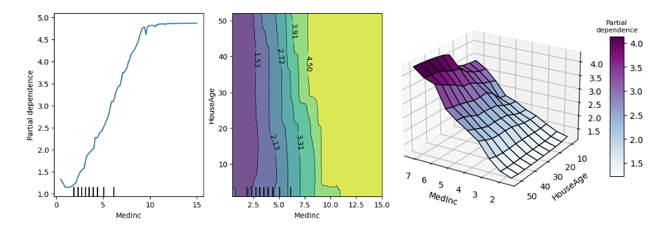
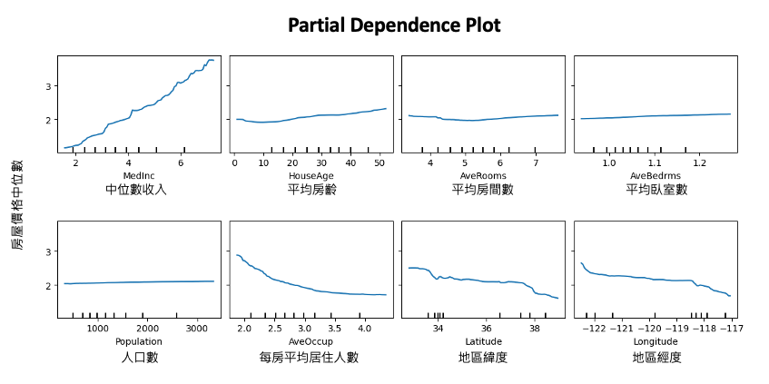
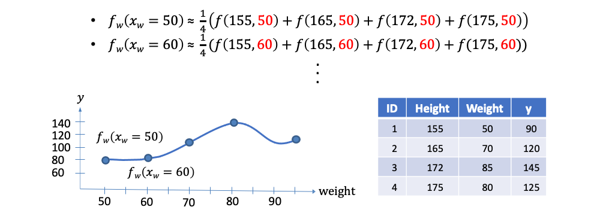
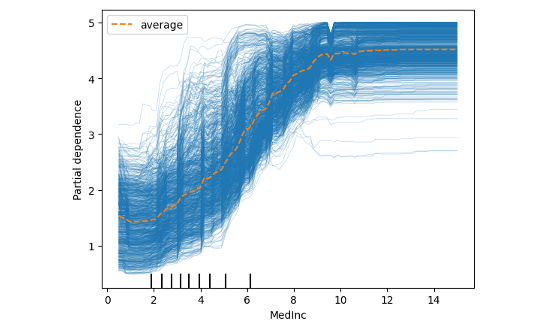

# [Day 11] Partial Dependence Plot：探索特徵對預測值的影響
範例程式：[](https://colab.research.google.com/github/andy6804tw/crazyai-xai/blob/main/code/11.Partial Dependence Plot：探索特徵對預測值的影響.ipynb)


Partial Dependence Plot（PDP）是要觀察每一個自變數的變化是如何影響預測表現，它可以快速地分析自變數與目標變數之間的關係。而昨天所提的 Permutation Importance 是要觀察某個特徵會有多大的程度影響預測的錯誤率，進而取得重要程度排序。除此之外 PDP 也能考慮到特徵的交互作用，可以同時觀察兩個或以上的特徵合起來如何去影響預測結果。但以實務面來說為了可以視覺化預測結果，通常 PDP 最多會同時考慮兩個特徵，因為超過三個維度就比較難用視覺去呈現結果。今天討論的方法也是一種與模型無關的可解釋技術。



我們再以房價預測為例，可以從下面這八張 Partial Dependence 圖觀察哪些特徵是對於 y（房價）的影響是比較明顯的。其中越平坦的曲線代表該特徵越不重要，這意味著我不管怎樣變動該特徵的值對於預測結果都差不多，反之，上下起伏比較明顯的線代表該特徵極為重要。例如左上角的中位數收入，從中我們可以發現，該特徵對模型預測來說只要稍微變動一個單位對於輸出結果有明顯的影響。同時可以說明該特徵從美金 1.58 到 7.23 萬美元，隨著收入逐漸地增長，影響該地區的房價是正相關的。



> 我們可以透過 PDP 逐一觀察每個特徵跟輸出的關係。

## Partial Dependence 演算法流程
接下來要來討論 Partial Dependence 是如何被計算出來的。首先我們有一組訓練資料共有 d 個特徵，因此訓練一個模型 f 輸入為 x1~xd，目標是要預測 y。透過蒙地卡羅法希望可以觀察某個 xj 特徵的值它的相對應輸出是多少。因此我們可以從訓練集中抽取 m 筆資料樣本，並將要被觀察的特徵 xj 固定一個數值 t，而其他的特徵就用剛剛隨機抽出的樣本依序帶值進去。每次帶一筆進去後都會輸出一個 y，總共會得到 m 個結果最終在平均取來的數值就是 xj 對於 t 的情況下所估計的結果。


1. 從測試集或資料集中，隨機取出一個樣本𝑧
2. 把𝑧的特徵 𝑥𝑗 改為 𝑡，其他特徵不變，得到新樣本𝑧′
3. 透過訓練好的模型，得到新樣本的預測值 ŷ′=𝑓(𝑧′)
4. 重複以上步驟 m 次，得到 m 個預測值 ŷ′1,ŷ′2,...,ŷ′m
5. 計算平均值，即為 𝑓(𝑥𝑗=𝑡) 的估計值。
6. 重複以上步驟，得到其他特徵的 PDP。

> 至於t要有幾個取決於該特徵的上下界，並透過grid_resolution參數設定要在這範圍間取得幾組做為t。

這裡舉個例子，我們想要用身高和體重兩個特徵去預測一個人的血壓。假設我們要觀察體重50公斤的血壓是多少，我們會先從資料集中採樣 m 筆資料(這裡有四筆，m=4)。接著從這四筆資料中固定體重都改成50，其餘身高保值不變並放入事先訓練好的模型進行預測得到 ŷ。最終把這四個模型預測的 ŷ 加總做平均就可以得到預測體重 50 公斤的人平均的血壓是多少。同樣以此概念我們可以得到隨著體重的變化(60kg, 70kg...)模型預測出來的血壓應該是多少。



## 基於 Partial Dependence 的特徵重要性分析
在之前的內容中，我們已經學到如果一個特徵的 Partial Dependence Plot（PDP） 呈現出「平坦」的曲線，代表該特徵對目標變數的影響不重要。但是，如何測量一個曲線的「平坦度」呢？其中一個方法是使用標準差來衡量其反平坦度。如果我們評估了函數 𝑓j(xj=vk)（其中k=1,...,K），則特徵 xj 的重要性可以定義為其標準差。計算完每個特徵的標準差後，其標準差越大的特徵我們可以視為越重要。


使用 PDP 尋找重要特徵時必須要注意資料的合理性，怎麼說呢？若 xj 與其他特徵存在某種關係，我們隨機抽取樣本填入可能抽到極不合理的特徵組合。例如上面的預測血壓例子當中可能會產生(身高180cm,體重40kg)的極端組合，這種情形現實生活中較難出現此案例，因此可能錯估結果。

## PDP 對於資料異質性的影響
雖然 PDP 有助於可視化預測響應與一個或多個特徵之間的平均部分相依關係。但在存在實質交互作用影響下，部分響應關係可能是異質的（heterogeneities）。因此像 PDP 這樣的平均曲線可能會掩蓋建模關係的複雜性。所以我們可以透過 ICE 圖繪製個別觀測值的預測響應與特徵之間的函數關係來改進部分相依圖。在下圖 a 中，我們繪製了樣本中的 X2 與 Y 的散點圖。圖 b 顯示了預測特徵 X2 的擬合模型的部分相依圖。PDP 顯示就平均而言，X2 與預測的 Y 沒有顯著的相關性。但是從圖 a 中可以明顯看出，這個結論是錯誤的。很明顯 X2 與 Y 有關聯，只是 PDP 中的平均化掩蓋了這一發現。因此 PDP 的缺點在於可能掩蓋資料中的異質性。因此還有另一種變形是個體條件期望圖（ICE Plot），如圖 c 所示。ICE plot 可以清楚地顯示預測值和特徵 X2 之間的關係。從中我們可以發現，此模型的預測值在特徵 X2 的不同區域內呈現近似線性增加或減少的趨勢。


## ICE Plot
剛剛的例子中 PDP 在展示單一特徵對預測值的影響時，可能會掩蓋掉特徵和其他特徵之間的交互作用，進而限制了 PDP 的解釋能力。為了克服這個問題，在篇論文：[Peeking Inside the Black Box: Visualizing Statistical Learning with Plots of Individual Conditional Expectation](https://arxiv.org/pdf/1309.6392.pdf) 作者提出了 ICE plot（Individual Conditional Expectation plot）的概念，可以更好地展示特徵之間的交互作用。ICE plot 類似於 PDP，但是它繪製的是每個觀測值的個別條線，因此可以更好地呈現特徵之間的差異和交互作用。

1. 從測試集或資料集中，隨機取出一個樣本𝑧
2. 把𝑧的特徵 𝑥𝑗 改為 𝑡，其他特徵不變，得到新樣本𝑧′
3. 透過訓練好的模型，得到新樣本的預測值 ŷ′=𝑓(𝑧′)
4. 重複以上步驟 m 次，得到 m 個預測值 ŷ′1,ŷ′2,...,ŷ′m
5. 將這 m 個預測值與原始樣本𝑧的特徵𝑥𝑗的值一起畫在圖上
6. 重複以上步驟，得到其他特徵的 ICE Plot。

## sklearn 實作 Partial Dependence
在 sklearn 中有提供兩種 PDP 的 API 分別為 partial_dependence 和 PartialDependenceDisplay，兩者是用於呈現部分相依 (partial dependence) 的工具，但它們的使用方式和顯示效果有所不同。

- partial_dependence 是一個函數，可用來計算部分相依值並返回結果。
- PartialDependenceDisplay 可以直接繪製部分相依圖，透過視覺化方法比較不同特徵的影響。

> 本日的內容建議在 Python 3.8 和 scikit-learn 1.2.2 版本以上執行。


> 參考: [sklearn.inspection: Inspection](https://scikit-learn.org/stable/modules/classes.html#module-sklearn.inspection)


今天的範例延續昨天的房價預測資料集，並先訓練好隨機森林迴歸模型。

```py
from sklearn.datasets import fetch_california_housing
from sklearn.model_selection import train_test_split
from sklearn.ensemble import RandomForestRegressor
import numpy as np
import pandas as pd

# 載入加州地區房屋價格預測資料集
data = fetch_california_housing()
feature_names = np.array(data.feature_names)
X, y = data.data, data.target

# 切分資料集為訓練集和測試集
X_train, X_test, y_train, y_test = train_test_split(X, y, random_state=42)

# 訓練隨機森林迴歸模型
model = RandomForestRegressor(random_state=0).fit(X, y)
```

接著是本日實作重點，這裡採用 `PartialDependenceDisplay` 方法搭配 from_estimator 放入事先訓練好的 sklearn 模型，並放入測試資料集進行全域的模型解釋。以下是該方法常用到的參數，若想更進階使用可以參考官方[文件](https://scikit-learn.org/stable/modules/generated/sklearn.inspection.PartialDependenceDisplay.html)。

Parameters:
- estimator: 已訓練的預測器物件，必須實作 predict、predict_proba 或 decision_function 方法。
- X: 可放入訓練資料或是測試資料集，另外要注意是否有前處理。
- features: 需要分析的特徵，可以為一個或多個特徵，若為一個則生成單特徵的部分相依圖，若兩個則生成2-way部分相依圖（kind='average'時才支援），每個元素可以是特徵索引或特徵名稱或特徵索引或特徵名稱的tuple。
- categorical_features: PDP也支援類別型的特徵解釋，用法跟 features 一樣。
- feature_names: 用於指定每個特徵的名稱，預設值為None。
- grid_resolution: 網格解析度，數值越大越能呈現特徵與目標變數之間的關係，預設值為100。
- percentiles: 用於限制PDP的X軸上下界，以百分位數表示，預設值為(0.05, 0.95)。
- centered: 是否將ICE和PD線的起始點設為y軸原點從0開始，預設為False。
- kind: 以字串格式設定，提供三種繪製形式 'average' 就是單純的PDP繪製;'individual' 繪製ICE plot;'both' 則代表同時繪製PD與ICE plot。預設為'average'。

```py
from sklearn.inspection import PartialDependenceDisplay

PartialDependenceDisplay.from_estimator(model,X_test, ['MedInc'], 
                                        feature_names=feature_names, 
                                        centered =False, 
                                        kind='average', 
                                        percentiles=(0, 1),
                                        grid_resolution=100)
```

輸出結果：


試著將參數修改 `kind='both'`，我們就可以同時得到 ICE Plot 以及中間橘色線條就是每個樣本平均後的 PDP。




## Reference
- Friedman, Jerome H. "[Greedy function approximation: A gradient boosting machine.](https://projecteuclid.org/journals/annals-of-statistics/volume-29/issue-5/Greedy-function-approximation-A-gradient-boostingmachine/10.1214/aos/1013203451.full)" Annals of statistics (2001): 1189-1232.
- Alex goldstein. (2014). [Peeking Inside the Black Box: Visualizing Statistical Learning with Plots of Individual Conditional Expectation](https://arxiv.org/pdf/1309.6392.pdf). Arxiv.