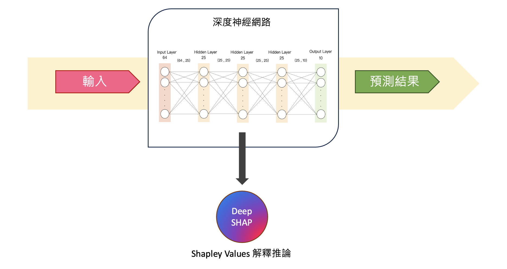
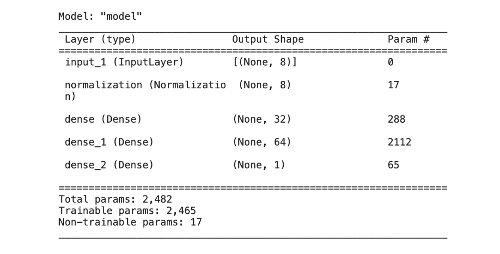
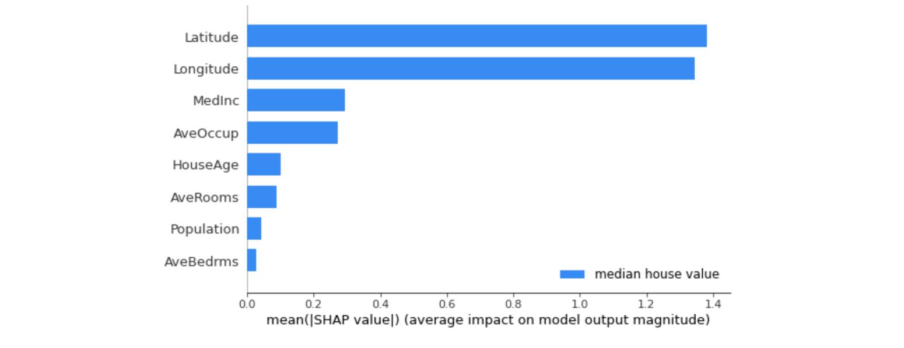
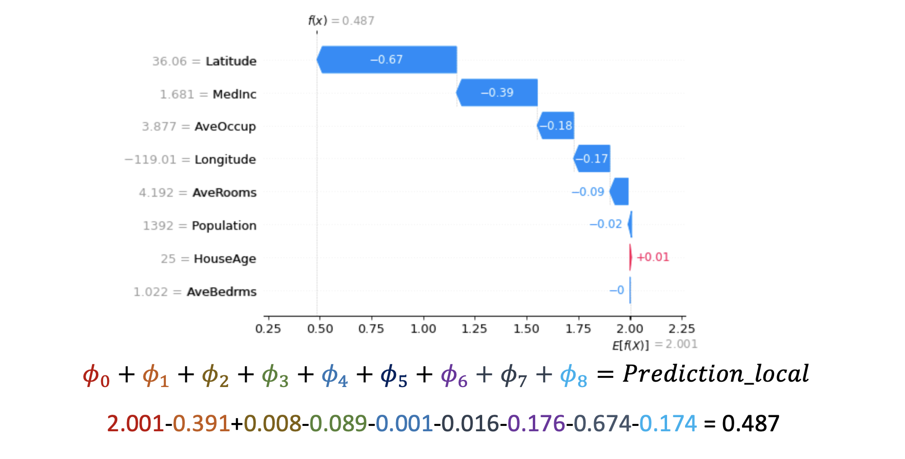

# [Day 17] 解析深度神經網路：使用Deep SHAP進行模型解釋
範例程式：[](https://colab.research.google.com/github/andy6804tw/crazyai-xai/blob/main/code/17.解析深度神經網路：使用Deep SHAP進行模型解釋.ipynb)

## Feature Attribution
Feature Attribution(特徵歸因)是機器學習領域中的一個重要概念，它用於解釋模型的預測結果。當我們訓練機器學習模型，特別是深度學習模型，這些模型通常是黑盒子，難以理解為什麼模型會做出特定的預測。因此`特徵歸因`的目標是找出模型中每個輸入特徵對於最終預測的貢獻或影響程度，這有助於我們理解模型的運作原理，並檢查模型是否依據我們的期望運作，以及發現可能的偏差或不公平性。在機器學習中，特徵歸因通常有以下幾種常見的方法：

- 特徵重要性（Feature Importance）：這種方法衡量了每個特徵對於模型預測的影響程度，可以透過 LIME 或 SHAP 等解釋工具進行特徵重要性分析。
    - SHAP（SHapley Additive exPlanations）：SHAP 基於博弈論的概念，它試圖將每個特徵的貢獻分配給模型預測的結果。Shapley values綜合考慮了特徵的重要性以及特徵之間的交互作用，因此在解釋複雜模型時很有用。
    - LIME（Local Interpretable Model-agnostic Explanations）：LIME 通常用於解釋某筆資料為何做出這樣判斷，它主要生成一個簡單可解釋的線性模型，來解釋模型的預測。
- 基於梯度方法（Gradient-Based Methods）：這些方法基於模型的梯度訊息，試圖找出哪些特徵對於某個預測的梯度貢獻最大。
- 遮罩或屏蔽方法（Masking or Perturbation Methods）：這些方法通過對輸入特徵進行修改，觀察模型預測的變化，來評估每個特徵的重要性。例如可以將某個特徵的值設置為零，然後觀察預測的變化。

## Additive Feature Attribution Methods
Additive Feature Attribution(AFA) 方法的核心思想是將一個模型的預測分解成每個特徵的貢獻部分，這樣可以更容易理解模型的決策過程。該方法旨在理解每個特徵對模型預測的貢獻，它們假設模型對於輸入特徵的預測是可分解的，因此模型的預測可以被分解成每個特徵的影響，並且這些影響是可以相加的。一些解釋機器學習模型預測的方法，例如 LIME、SHAP、DeepLIFT 和 Layer-Wise Relevance Propagation，這些方法都屬於 AFA 的家族其中一員。AFA 方法的基本定義如下：


- g是一個簡單的可解釋模型，它可能是一個用於解釋複雜模型的模型，通常是一個線性模型或類似的簡單模型。
- 式子中的每個𝜙i代表第i個特徵的影響程度或重要性。當一個特徵的𝜙i值較大時，意味著這個特徵對模型的預測有較大的影響。
- 𝑧′是一個由0和1組成的二元向量，其中M代表簡化特徵的數量。這個向量表示了在模型中哪些特徵被考慮到，哪些沒有被考慮到。當特徵在向量中對應的位置是1時，表示這個特徵在模型中被考慮到了；當對應位置是0時，表示該特徵未被考慮。

簡單來說，AFA 方法的目標是通過一個簡單的可解釋模型 g 來解釋複雜模型的預測。它使用二元向量 𝑧′ 來表示哪些特徵在解釋中被考慮，並使用 𝜙i 作為權重來量化每個特徵對預測的影響程度。這樣的方法有助於理解模型是如何根據不同的特徵來做出預測的，提高了模型的可解釋性。不同的 AFA 方法可能使用不同的技術來計算 𝜙i 值，但它們都遵循這個基本框架進行模型解釋。

## Deep SHAP (DeepLIFT + Shapley Values)
今天要介紹在 SHAP 套件中的 Deep SHAP 方法，它結合了 DeepLIFT 和 Shapley values 的概念，以計算每個特徵對於模型預測的貢獻，使更好地解釋神經網路模型的預測。



- [DeepLIFT](https://arxiv.org/abs/1704.02685) (Deep Learning Important FeaTures)：是基於反向傳播的解釋方法，透過比較模型的預測輸出與參考輸出之間的差異來計算每個輸入特徵對預測的貢獻。使得我們可以了解每個特徵對模型預測的相對影響。

- Shapley Values：用於評估每個特徵對模型預測的影響。它考慮了每個特徵的不同排列組合，以確定每個特徵的貢獻度。使得我們可以更好地理解模型預測背後的特徵重要性。

> 今天的練習將使用 SHAP 套件中的 DeepExplainer(Deep SHAP) 方法作為展示。

## [實作] 使用 Deep SHAP 解釋 DNN 模型
本日範例將透過 TensorFlow 實作 DNN 模型，並使用 sklearn 的資料集 [fetch_california_housing](https://scikit-learn.org/stable/modules/generated/sklearn.datasets.fetch_california_housing.html) 來預測加州地區的房屋價格中位數。這個資料集包含了 8 個特徵，分別是：


- MedInc：該區域內家庭收入的中位數
- HouseAge：該區域內房屋的平均房齡
- AveRooms：該區域內房屋的平均房間數
- AveBedrms：該區域內房屋的平均臥室數
- Population：該區域內人口數
- AveOccup：該區域內平均每個房屋的居住人數
- Latitude：該區域內房屋所在緯度
- Longitude：該區域內房屋所在經度

這個資料集包含了 20640 筆樣本，每個樣本都有上述 8 個特徵以及房屋價格中位數作為目標變數。

```py
from sklearn.datasets import fetch_california_housing
from sklearn.model_selection import train_test_split
import numpy as np

# 載入加州地區房屋價格預測資料集
data = fetch_california_housing()
x_feature_names = np.array(data.feature_names)
X, y = data.data, data.target

# 切分資料集為訓練集和測試集
X_train, X_test, y_train, y_test = train_test_split(X, y, test_size =0.001, random_state=42)
```

## 建立與訓練神經網路
以下程式碼使用 Tensorflow2.0 Functional API 搭建神經網路。此模型接受一個輸入，然後通過一系列神經網路層進行處運算，最後輸出一個單一的數值即為房屋價格中位數。模型的層次結構包括：一個正規化層（Normalization）用於對輸入進行正規化，三個全連接層（Dense）用於提取特徵和學習模型的映射，最後一個全連接層輸出單一值，並使用 ReLU 激發函數達到非線性轉換。

```py
import tensorflow as tf
from tensorflow.keras import layers
from tensorflow.keras.models import Model

def build_model():
    # 資料正規化
    model_input = layers.Input(shape=X.shape[-1])
    norm_layer = tf.keras.layers.Normalization(axis=1)
    norm_layer.adapt(X_train)
    x = norm_layer(model_input)
    # 第一層隱藏層
    x = layers.Dense(32,activation='relu')(x)
    # 第二層隱藏層
    x = layers.Dense(64,activation='relu')(x)
    # 輸出層
    model_output = layers.Dense(1,activation='relu')(x)
    return Model(model_input ,model_output)
```

接下來，使用之前定義的 `build_model()` 函數建立一個新的神經網絡模型，並將這個模型存儲在 model 變數中。最後使用 `model.summary()` 印出模型的摘要訊息，包括模型的結構、每一層的參數數量等。

```py
tf.keras.backend.clear_session()
model = build_model()
model.summary()
```



模型準備就緒後即可開始訓練模型。這裡使用 Adam 優化器設定學習率為 0.001，並使用均方誤差（MSE）作為損失函數。接下來設定批次大小為 64，訓練迭代次數為 50 次。最後使用訓練數據 X_train 和 y_train 來訓練模型。

```py
from tensorflow.keras.optimizers import Adam

# 編譯模型
optim = Adam(learning_rate=0.001)
model.compile(loss='mse',
              optimizer=optim)

batch_size=64
epochs = 50

# 訓練模型
history = model.fit(X_train, y_train,
                    batch_size=batch_size,
                    epochs=epochs,
                    verbose=1,
                    shuffle=True,
                    validation_split=0.1)
```

## Deep SHAP 解釋模型
以下建立一個 DeepExplainer 解釋器，並指定了要解釋的模型（model）和訓練數據（X_train）。然後透過 Deep SHAP 來估計 Shapley values，並將其存儲在 shap_values 變數中。

```py
import shap
shap.initjs()

# 使用 Deep SHAP 解釋模型
explainer = shap.DeepExplainer(model=model, data=X_train)
# 估計 Shapley values
shap_values = explainer.shap_values(X_test)
```

### SHAP Summary Plot (全局解釋)
我們可以透過 SHAP Summary Plot 進行模型的全局解釋，該圖表顯示每個特徵變量對整體平均模型輸出的平均影響。在該圖表中，我們可以看到每個特徵對於模型的預測輸出的平均貢獻程度，有助於理解哪些特徵對模型的預測起著重要作用，哪些特徵影響較小。從分析結果可以發現地理位置(經緯度)以及家庭收入和成員數對於預測該地區房價是有顯著的影響性。

```py
# 獲得每個特徵對於整體平均貢獻的值
shap.summary_plot(shap_values[0], X_test, class_names=['median house value'], feature_names=x_feature_names)
```



### SHAP Force plot (單筆資料解釋)
由於我們從資料集切割 21 筆作為測試集，剛剛上面的全局解釋是針對這 21 筆資料進行平均整體性解釋。接著我們一樣可以針對每一筆數據進行解釋分析。首先程式中的 index 被設定為0，表示我們要觀察測試集中的第一筆資料。接著使用 `force_plot` 對這筆資料進行預測，並將分析結果視覺化呈現。

```py
# 觀察測試集中第一筆資料預測重要程度
index=0
print(f'測試集第 {index+1} 筆模型預測結果: {model.predict(X_test[[index], :])[0]}')
shap.force_plot(explainer.expected_value.numpy(),
                 shap_values[0][0][index],
                 X_test[index],
                 feature_names=x_feature_names)
```

> 可以試著調整 index 數值(0~20)觀察測試集中不同資料點的解釋


### SHAP waterfall plot (單筆資料解釋)
瀑布圖是一種能夠以視覺方式呈現單一預測解釋結果的工具。瀑布圖的起點是模型輸出的基準值 E[f(z)]，代表模型在不看任何特徵狀況下預測的數值（𝜙0）。然後每一個條都記錄了每個特徵對於輸出模型預測值的正向（紅色）或負向（藍色）影響。全部累加起來得到輸出值（即所有特徵貢獻𝜙i和基準值𝜙0的總和），即等同於實際模型的預測。

```py
index=0
shap.waterfall_plot(shap.Explanation(values=shap_values[0][0][index], 
                                    base_values=explainer.expected_value.numpy()[0], data=X_test[index],  
                                    feature_names=x_feature_names))
```




## Reference
- Avanti Shrikumar, et al. "[Learning Important Features Through Propagating Activation Differences](https://arxiv.org/abs/1704.02685)." Arxiv, 2017.
- [shap.DeepExplainer](https://shap-lrjball.readthedocs.io/en/latest/generated/shap.DeepExplainer.html#shap-deepexplainer)


- [Interpretability of Deep Learning Models](https://medium.com/towards-data-science/interpretability-of-deep-learning-models-9f52e54d72ab)
- [Additive Feature Attribution Methods](https://medium.com/@jimmywu0621/%E5%8F%AF%E8%A7%A3%E9%87%8B%EF%BD%81%EF%BD%89-%E4%BB%80%E9%BA%BC%E6%98%AFshap-5ec3953e3c5b)
- [Deep SHAP 鑽石範例](https://towardsdatascience.com/interpretability-of-deep-learning-models-9f52e54d72ab)
- [翻譯Deep SHAP 鑽石範例](https://kknews.cc/zh-tw/code/n9lyk23.html)