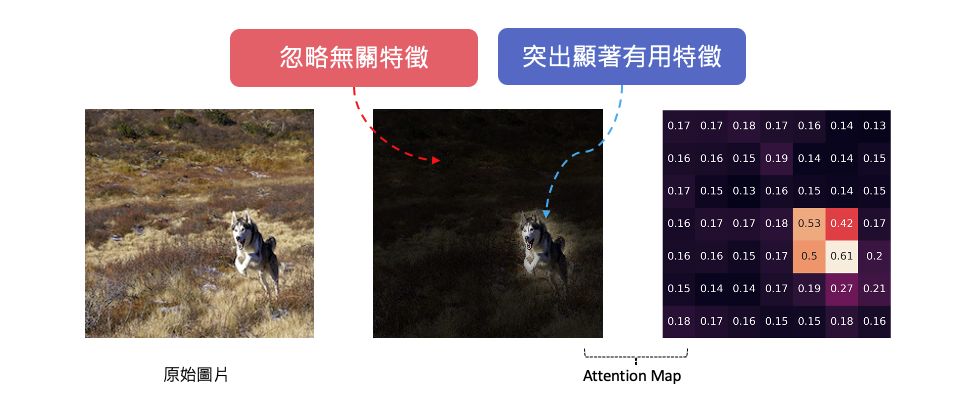
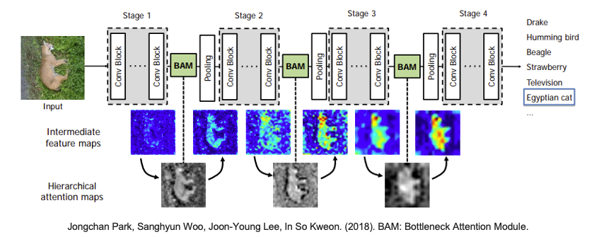
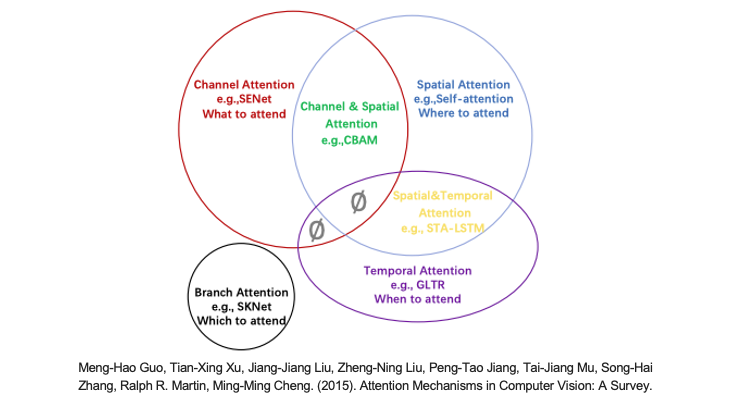
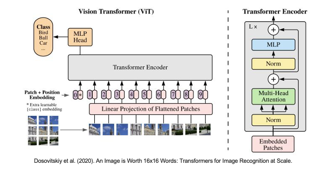
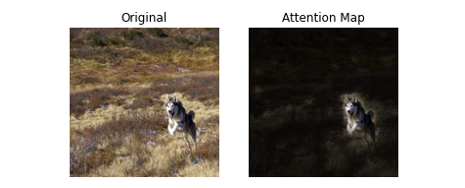

# [Day 23] Attention-Based：使用注意力機制解釋CNN模型

近年來注意力機制（Attention Mechanism）已經成為深度學習和神經網路領域的一個重要研究。它不僅能夠改善模型的性能，還可以增強模型的解釋性。2018 年圖靈獎得主同時也是深度學習三大巨頭之一的 Yoshua Bengio 也曾經說過：[Attention is a core ingredient of ‘conscious’ AI](https://venturebeat.com/ai/yoshua-bengio-attention-is-a-core-ingredient-of-consciousness-ai/)。透過有意識的認知系統，進一步模仿人類的行為，以提高模型學習的效果，這就是注意力機制的研究主題。在前幾天的文章中我們學習了許多 CNN 的解釋方法，如 Perturbation-Based、Gradient-Based、Propagation-Based、CAM-Based等，在解釋 CNN 模型方面有一定的局限性。為了克服這些局限性，研究人員開始採用注意力機制，並將所謂的 Attention Layer 其嵌入到 CNN 模型中，以實現更好的解釋性和性能。當然注意力機制不僅僅只侷限在圖像識別任務上，自然語言處理及語音處理也可以用到此技術，這也意味著各種神經網路都可以套用注意力機制的概念。然而在今天的文章內容當中，我們將關注在如何透過注意力機制應用在圖像識別任務上。

> 延伸閱讀：[淺談有意識的 AI： 注意力機制介紹](https://medium.com/@andy6804tw/%E6%B7%BA%E8%AB%87%E6%9C%89%E6%84%8F%E8%AD%98%E7%9A%84-ai-%E6%B3%A8%E6%84%8F%E5%8A%9B%E6%A9%9F%E5%88%B6%E4%BB%8B%E7%B4%B9-59ec5b825b3e)

## 注意力機制的優勢
在探討如何使用注意力機制來解釋 CNN 模型之前，讓我們首先理解注意力機制的優勢。注意力機制允許模型根據輸入的不同部分調整其關注程度，這使得模型更能夠理解和解釋複雜的數據。相比於傳統的解釋方法，注意力機制更具靈活性，能夠從特徵圖中自動學習關鍵訊息，並將其納入決策過程。



在注意力機制中，我們通常使用一組向量權重（或分數）來指示模型在處理輸入序列時對不同部分的關注程度。讓我們以數學符號來表示：


1. 輸入序列：假設我們有一個長度為N的輸入序列，通常表示為X = [x₁, x₂, ..., xᴺ]，其中每個xᵢ是一個特徵或時間序列的表示。
2. 注意力權重：我們引入一個注意力權重向量A = [a₁, a₂, ..., aᴺ]，其中每個aᵢ代表模型對輸入序列中相應位置的關注程度。這些權重通常是實數，並滿足正規化條件，即∑aᵢ = 1（注意力機制總和為1）。

向量權重在數學上代表了注意力機制的核心概念，它們決定了模型在處理輸入序列時的關注程度，並有助於提高模型的效能和解釋性。套用在卷積神經網路中我們可以計算每一個特徵圖(feature maps)所對應的注意力權重，並可以知道途中哪個位置是模型關注的地方。那該如何計算注意力分數呢？這就是另一門學術研究在探討的事情，因為他有非常多的技巧可以計算這些注意力分數。下圖就是取自一篇 [BAM: Bottleneck Attention Module](https://arxiv.org/abs/1807.06514)研究，在卷積層間加入一個注意力模塊，並將含有注意力機制的特徵圖繪製出來，觀察模型是否真的有關注到重點區域。



## 注意力機制於電腦視覺模型
注意機制被引入到電腦視覺中，其目的是模仿人類視覺系統。這種注意機制可以看作是一個基於輸入圖像特徵的動態權重調整過程。其中這篇論文 [Attention Mechanisms in Computer Vision: A Survey](https://arxiv.org/abs/2111.07624.pdf) 總結了電腦視覺中的各種注意機制，並對所有 CV Attention 研究進行分類。相關的論文研究整理也能參考 GitHub 上的專案 [Awesome-Vision-Attentions](https://github.com/MenghaoGuo/Awesome-Vision-Attentions) 原作者統整了近年電腦視覺領域中各種注意力機制的研究。就注意力關注的域來分，大致可以分成以下六種：

- 通道注意力 (Channel Attention)
- 空間注意力 (Spatial Attention)
- 時間注意力 (Temporal Attention)
- 分支注意力 (Branch Attention)
- 通道空間注意力 (Channel & Spatial Attention)
- 時空注意力 (Spatial & Temporal Attention)



> 延伸閱讀：[電腦視覺中的注意力機制](https://medium.com/@andy6804tw/%E9%9B%BB%E8%85%A6%E8%A6%96%E8%A6%BA%E4%B8%AD%E7%9A%84%E6%B3%A8%E6%84%8F%E5%8A%9B%E6%A9%9F%E5%88%B6-545e08c1afc1)

## 注意力機制於 Transformer 模型
自從2017年Google發表了 [Attention Is All You Need](https://arxiv.org/abs/1706.03762) 這篇論文，Transformer 架構的提出完全改變了神經網路的局勢。在這篇論文中，他們引入了一種稱為 Transformer 的網路結構，它不再依賴於 RNN 或 CNN，而是完全採用了自注意力機制（self-attention mechanism）。這種自注意力機制允許模型在 Encoder-Decoder 之間更靈活地操作，為深度學習帶來了更多的靈活性。然而 self-attention 這樣的技術應用在電腦視覺中是屬於剛剛提到的六大項中的`空間注意力` (Spatial Attention)這一大類。


在電腦視覺領域，Transformer 架構的變形和經典網路相結合已經產生了多個成功的模型。以下是一些使用 Transformer 架構的經典或知名模型的變形：

- [Vision Transformer](https://arxiv.org/abs/2010.11929)（ViT）(Dosovitskiy et al., 2020) `Google Research`：Vision Transformer是將Transformer架構應用於圖像分類的經典模型。它將圖像分割為一系列固定大小的塊，然後將它們轉換成序列，並使用Transformer中的Encoder來處理這個序列達到影像分類。

- [Data-efficient Image Transformer](https://arxiv.org/abs/2012.12877)（DeiT）(Touvron et al., 2020) `Facebook AI`：DeiT是一種數據高效的Vision Transformer，透過數據增強和知識蒸餾技術，能夠在資料有限的狀況下，同時能夠保持跟ViT一樣的效果甚至比用CNN的網路還來得好。

- [MobileViT](https://arxiv.org/abs/2110.02178) (Mehta et al., 2021) `Apple`：MobileViT是一個專為移動設備優化的變種Vision Transformer模型，它保持了高性能的同時，具有更小的模型大小和更低的計算成本。

- [Swin Transformer](https://arxiv.org/abs/2103.14030) (Liu et al., 2021) `Microsoft Research`：Swin Transformer是一種多尺度特徵建模的模型，透過滑動窗口的方法進行注意力機制操作，可以處理不同尺度的特徵。它在圖像分類、物體檢測和分割等任務上取得了優異的成績。

- [Class-Attention in Image Transformers](https://arxiv.org/abs/2103.17239)（CaiT）(Touvron et al., 2021) `Facebook AI`：CaiT是一種基於Transformer的模型，它引入了類別感知（class-aware）的注意力機制，以改善圖像分類性能。這種模型通常對圖像中不同類別的訊息進行更好的建模。

從上述論文中可以觀察到，大多數研究工作都來自大型企業或研究機構，這是因為訓練 Transformer 模型需要龐大的資料集和計算資源。因此要進入 Transformer 的研究領域，需要具備豐富的資源投入。舉例來說，像最近備受關注的 ChatGPT，背後依賴於大型語言模型（LLM），例如 GPT、PaLM 和 LLaMA ...等，這些語言模型都建立在Transformer 架構之上，訓練一次可能需要數千萬甚至億級的成本。幸運的是，這些機構通常會釋出預訓練模型的權重，因此我們可以通過微調或遷移學習等方式來滿足我們的需求。

## Attention-Based 實作 (Vision Transformer)
今天的範例將使用 Vision Transformer 預訓練模型來示範如何透過 Attention Rollout 方法解釋模型推論結果。Transformer 已經成為熱門的神經網路架構，並廣泛應用於自然語言處理任務，像是現今最火紅的 ChatGPT 背後的語言模型也是基於注意力機制的 Transformer 架構為基底。它的成功源於 2017 年 Google 提出的 "Attention Is All You Need"。這一重大突破促使 Google 團隊將 Transformer 架構中的 Encoder 抽離出來，創造了 Vision Transformer（ViT），用於影像分類技術。此外，ViT 放棄了 CNN 層，轉而使用自注意力機制進行計算，在分類問題上取得了優異的成績。



> Vision Transformer 論文：[An Image is Worth 16x16 Words: Transformers for Image Recognition at Scale](https://arxiv.org/abs/2010.11929)

> 延伸閱讀：[[論文導讀] Vision Transformer (ViT) 附程式碼實作](https://medium.com/@andy6804tw/%E8%AB%96%E6%96%87%E5%B0%8E%E8%AE%80-vision-transformer-vit-%E9%99%84%E7%A8%8B%E5%BC%8F%E7%A2%BC%E5%AF%A6%E4%BD%9C-379306ea2fb)

在今天的範例實作中我們不會手刻整個 ViT 網路架構，也不會從頭自己訓練模型。而是使用非官方已訓練好的預訓練模型進行展示。首先要安裝 [vit-keras](https://github.com/faustomorales/vit-keras) 套件，這是一個非官方的 Keras 版本實作，我們也可以拿它來做遷移學習。除此之外還需要安裝 `tensorflow_addons` 它是 TensorFlow 的一個附加庫，提供了一系列額外的自定義操作和層，以擴展 TensorFlow 的功能，因為實作 ViT 會需要用到像是 gelu 的激發函數。

```sh
pip install vit-keras
pip install tensorflow_addons
```

> 必須確保電腦已先安裝 TensorFlow2.0 以上


這段程式碼的主要目的是創建一個 Vision Transformer 模型，並獲取 ImageNet 分類的類別列表。該模型可以用於圖像分類等任務。其中我們是採用 `vit_b16` 的網路架構，b16 中的 16 表示著每個圖像的輸入都被分割成了固定大小的圖像塊（或稱為 "patches"），這些圖像塊的大小為 16x16 像素。這些圖像塊被用作模型的輸入，並通過自注意力機制來捕捉圖像中的全局訊息。

```py
import numpy as np
import matplotlib.pyplot as plt
from vit_keras import vit, utils, visualize

# 使用vit函數創建Vision Transformer模型
image_size = 224 # 設定輸入圖像的大小為 224x224 像素
model = vit.vit_b16(
    image_size=image_size,
    activation='sigmoid', # 輸出使用 sigmoid 激發函數
    pretrained=True, # 使用預訓練權重
    include_top=True, # 包括頂部（分類層）
    pretrained_top=True # 使用預訓練的頂部權重
)
# 取得 ImageNet 分類的類別
classes = utils.get_imagenet_classes()
```

在ViT的研究和實現過程中，出現了多種不同的架構變形，以適應不同的任務和需求。以下是`vit-keras` 套件中所提供的 ViT 架構變形：

- ViT Base Models：
    - ViT B16 （Vision Transformer Base with 16x16 patches）
    - ViT B32 （Vision Transformer Base with 32x32 patches）
- ViT Large Models：
    - ViT L16 （Vision Transformer Large with 16x16 patches）
    - ViT L32 （Vision Transformer Large with 32x32 patches）


`vit-keras` 套件目前尚未提供 ViT-Huge 模型的實現，因為這需要使用 `JFT: 300M images of 18K classes` 這個資料集進行訓練。此外這個資料集是由 Google 內部收集的，並且尚未釋出為開源資料集。

接下來實際載入一張圖像，並使用剛剛所建立的 ViT 模型進行預測，並輸出模型對圖像的預測結果。

```py
url = 'https://upload.wikimedia.org/wikipedia/commons/b/bc/Free%21_%283987584939%29.jpg'
image = utils.read(url, image_size) # 載入圖片
x = np.expand_dims(image.copy(), axis=0) # 將圖像轉換為模型可接受的維度
x = vit.preprocess_inputs(x) # 預處理圖像
# 進行圖像分類預測
pred_proba = model.predict(x) # 返回分類機率
# 解析預測結果
pred_class = pred_proba[0].argmax() # 取得預測標籤索引
predicted_class_name = classes[pred_class] # 取得預測標籤名稱
print('Prediction:', predicted_class_name)  
```

輸出結果：
```
Prediction: Eskimo dog, husky
```

最後使用論文中所提到的 `Attention Rollout` 方法來計算 ViT 模型中從 output token 到輸入圖像的注意力映射。簡單來說 Attention Rollout 就是計算從底層到高層的 Attention 矩陣的乘積。具體而言，Attention Rollout 的步驟包括：

1. 計算平均注意力權重： 首先計算模型中所有注意力頭的注意力權重的平均值，得到一個代表平均注意力的矩陣。
2. 遞迴相乘： 接下來，將這個平均注意力矩陣與模型的不同層次的注意力權重矩陣進行遞迴性相乘。這意味著將不同層次的注意力進行混合，以捕捉模型對輸入的綜合注意力分佈。
3. 得到最終注意力分佈： 最後這個遞迴相乘操作產生了最終的注意力分佈，描述了模型如何在不同層次上關注輸入數據的不同部分。

> Attention Rollout 詳細實作可以參考這個套件的[原始程式](https://github.com/faustomorales/vit-keras/blob/de4c78c7f52f857af114f0d69312ee22946e4056/vit_keras/visualize.py#L7)。

```py
# 計算 Attention Rollout 
attention_map = visualize.attention_map(model=model, image=image)
# 繪製結果
fig, (ax1, ax2) = plt.subplots(ncols=2)
ax1.axis('off')
ax2.axis('off')
ax1.set_title('Original')
ax2.set_title('Attention Map')
_ = ax1.imshow(image)
_ = ax2.imshow(attention_map)
```




## Reference
- [Explained: Attention Visualization with Attention Rollout](https://storrs.io/attention-rollout/)
- [Intro to Transformers and Transformer Explainability](https://www.youtube.com/watch?v=a0O_QhE9XFM)


其他有用資訊
- [Vision Transformer(ViT)重點筆記](https://hackmd.io/@YungHuiHsu/ByDHdxBS5)
- [Transformer可解釋性與視覺化](https://hackmd.io/SdKCrj2RTySHxLevJkIrZQ)


Vision Transformers Need Registers - Meta 2023
Paper: https://arxiv.org/abs/2309.16588