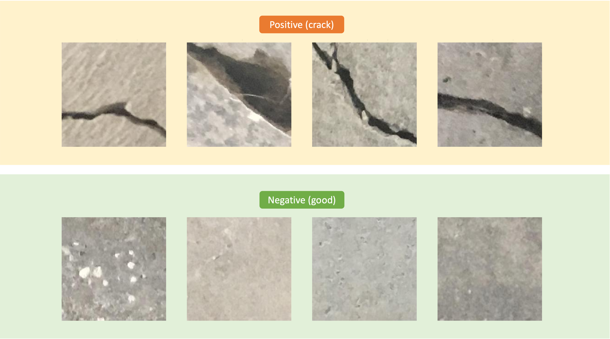
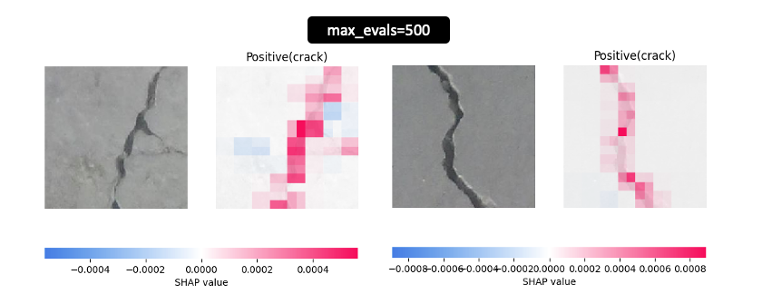
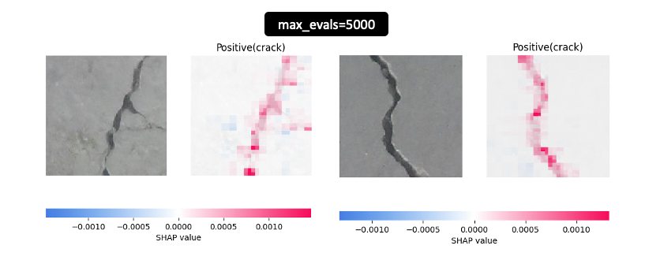

# [Day 25] XAI在影像處理中的瑕疵檢測：解釋卷積神經網路的運作
範例程式：[](https://www.kaggle.com/code/andy6804tw/day-25-xai)

隨著鐵人賽進入尾聲，相信各位已經對可解釋人工智慧（XAI）領域有了一些初步的了解。在接下來的幾天中，我想透過一些實際的例子來介紹 XAI 的實際應用，藉此展示如何透過人工智慧來解決企業中的機器學習問題。今天要介紹的例子涉及影像辨識中的瑕疵檢測。在影像處理中，瑕疵檢測是一個相當重要的應用領域，通常用於檢查製造過程中的產品或材料，以確保它們的品質達到標準要求。這個應用領域在許多不同的行業中都具有關鍵的地位，包括製造業、醫療、石化產業等等。

## [案例] 表面裂紋檢測
[Surface Crack Detection Dataset](https://www.kaggle.com/datasets/arunrk7/surface-crack-detection?select=Positive) 是一個用於混凝土表面裂縫檢測的資料集。這個資料集被分成兩個類別，分別是正面（有裂縫）和負面（無裂縫）。這兩類圖像被存儲在不同的資料夾中，以便進行圖像分類。每個類別包含20000張圖像，總共有40000張圖像，每張圖像的解析度為227 x 227像素，並且是彩色圖像。



## 載入預訓練模型(ResNet50)
在今天的實作中，我們將使用預訓練模型（ResNet50）來執行遷移學習（Transfer Learning），這是一種應用在分類任務上的學習方法。遷移學習是指，我們將先前訓練好的模型（通常是在大型數據集上訓練的模型）應用於新的任務或資料集，以提高模型的性能和準確度。這種方法通常能夠節省訓練新模型所需的大量時間和資源，同時能夠更快地達到良好的結果。首先使用 TensorFlow 建立了一個預訓練的 ResNet50 模型，並且將預訓練模型的權重設為不可訓練，並保留原始的特徵提取功能。由於 `include_top` 設定為 `False`，因此必須自己建立輸出的隱藏層與輸出層。因此我們自己建立了 `GlobalAveragePooling2D` 層將特徵圖的每個通道的平均值計算為一個數值。接著在模型的輸出層添加一個具有 sigmoid 激發函數的全連接層，用於二元分類。最後模型編譯，設定了優化器、損失函數和評估指標。

```py
import tensorflow as tf
from tensorflow.keras.models import Model
from tensorflow.keras import layers
from tensorflow.keras.applications.resnet import ResNet50, preprocess_input
from tensorflow.keras.optimizers import Adam

img_size = 150
model_name = 'ResNet50'

# 使用預訓練的ResNet50模型
pre_model = ResNet50(weights='imagenet', include_top=False,
                   input_shape=(img_size, img_size, 3))

# 將預訓練模型的權重設為不可訓練
pre_model.trainable = False
# 隱藏層
x = layers.GlobalAveragePooling2D()(pre_model.output)
# 輸出層
outputs = layers.Dense(1, activation='sigmoid')(x)
model = Model(inputs=pre_model.inputs, outputs=outputs)
# 設定優化器
optimizer = Adam(learning_rate=0.001)
# 編譯模型
model.compile(loss='binary_crossentropy',
              optimizer=optimizer,
              metrics=['accuracy'])
```

## 載入圖片
模型搭建完成後，接著建立用於訓練和驗證的圖像資料生成器（ImageDataGenerator）。訓練資料生成器進行了資料增強（Data Augmentation）操作，包括隨機位移、水平翻轉等，並使用指定的圖像前處理函式。然而在驗證集的部分不需要進行資料增強，僅需要附上圖向前處理的函式即可。

```py
from tensorflow.keras.preprocessing.image import ImageDataGenerator

# 建立訓練資料生成器
train_datagen = ImageDataGenerator(
               width_shift_range=0.1,  # 隨機水平位移圖像的範圍
               height_shift_range=0.1,  # 隨機垂直位移圖像的範圍
               horizontal_flip=True,  # 隨機水平翻轉圖像
               preprocessing_function=preprocess_input,  # 圖像前處理函數
               validation_split=0.01  # 驗證資料集的比例
              )

# 建立驗證資料生成器
validation_datagen = ImageDataGenerator(preprocessing_function=preprocess_input, validation_split=0.01)
```

這些生成器從指定的資料夾中讀取圖像，並生成用於模型訓練和驗證的批次圖像數據。它們被設置為進行二元分類，其中類別標籤是`正`和`負`，並根據比例從原始資料中選擇訓練和驗證的子集。

```py
# 設定圖像的尺寸
img_shape = (img_size, img_size)

# 創建訓練資料生成器，從指定資料夾中讀取圖像，並進行資料增強
train_generator = train_datagen.flow_from_directory(
                 '../input/surface-crack-detection',
                 target_size=(img_size, img_size),  # 調整圖像尺寸
                 batch_size=64,  # 批次大小
                 shuffle=True,  # 隨機打亂圖像順序
                 class_mode='binary',  # 二元分類
                 subset='training')  # 設定為訓練子集

# 創建驗證資料生成器，從指定資料夾中讀取圖像
validation_generator =  validation_datagen.flow_from_directory(
                        '../input/surface-crack-detection',
                        target_size=(img_size, img_size),  # 調整圖像尺寸
                        batch_size=64,  # 批次大小
                        class_mode='binary',  # 二元分類
                        subset='validation')  # 設定為驗證子集
```

## 訓練模型
一切已經準備就緒，現在可以開始訓練模型了。因為我們是基於預訓練模型進行分類遷移訓練，所以我們只需要設定訓練的迭代次數為3，這樣可以快速達到良好的準確度並完成模型訓練。

```py
# 訓練模型
model.fit(train_generator,
          epochs=3,
          validation_data=validation_generator)
```


## SHAP 解釋卷積神經網路的運作
本系列中已介紹了許多 CNN 的解釋方法，如 Perturbation-Based、Gradient-Based、Propagation-Based、CAM-Based、Attention-Based 等。這裡我們採用 SHAP 套件進行 CNN 模型的解釋，然而 SHAP 提供許多種不同的解釋器，這次選用 Partition SHAP 方法，搭配圖像遮擋技術進行卷積神經網路的解釋。首先我們從資料集中載入一張具有瑕疵裂痕的影像，這將成為我們要解釋的圖片。接著使用 ResNet50 模型的預處理函數 `preprocess_input()` 來處理這張圖像，以確保圖像的數值範圍和格式符合模型的要求。

```py
import numpy as np

# 載入圖像
image = tf.keras.utils.load_img('../input/surface-crack-detection/Positive/00001.jpg', target_size=(img_size, img_size))
image = tf.keras.utils.img_to_array(image) # 將載入的圖像轉換為數組形式
x = np.expand_dims(image.copy(), axis=0) # 將圖像轉換為模型可接受的維度
```

### SHAP Partition Explainer
Partition Explainer 是 SHAP 套件中的一種方法，用於解釋機器學習模型。針對 CNN 模型的解釋，它可以用於分析圖像分類模型的決策。例如對於一張圖像，我們可以使用 Partition Explainer 來評估不同區域中的像素對於模型的分類結果的影響。其背後的技術是透過 blur 或 inpaint 技術遮蓋圖像中的部分區塊，以查看圖像的哪些部分對預測有貢獻。


首先定義了一個函數`f(X)`該函數複製輸入的圖像X，然後進行預處理，最後返回模型的輸出。接著定義了一個 `masker`，用於遮蓋輸入圖像的部分區域。這個 masker 提供了三種方法來遮蓋圖像的部分區域，分別為有：

- inpaint_telea： 使用了 Telea 算法嘗試根據周圍的像素值快速且有效地填補遮罩區域。
- inpaint_ns：使用了 Navier-Stokes 算法以填補圖像中的遮罩區域，適合用於複雜紋理。
- blur(kernel_xsize,kernel_xsize)： 假設使用 blur(15, 15)，則表示核的大小為15x15，它會考慮每個像素周圍的鄰域，將這些像素的值進行平均，以達到模糊化的效果。

```py
import shap

# 包裝要被解釋的模型
def f(X):
    tmp = X.copy()
    preprocess_input(tmp) # 影像前處理
    return model(tmp)

# 定義一個 masker 用於遮罩圖像的部分區域
masker = shap.maskers.Image("inpaint_telea", x[0].shape)
```


然後我們使用 Explainer() 函數來創建一個 Partition Explainer 的實例。在該函數中，必須輸入三個重要的參數值：

- model: 要被解釋的模型，即範例程式中的 `f(X)`
- mask: 於使用blur或inpaint技術遮蓋圖像中的部分區塊
- output_names: 目標類別標籤名稱

```py
# 使用 Partition explainer 解釋模型
explainer = shap.Explainer(f, masker, output_names=["Positive(crack)"])
# 估計 Shapely values
shap_values = explainer(x, max_evals=500, batch_size=50, outputs=shap.Explanation.argsort.flip[:1])
```

我們將要被解釋的圖片放入 SHAP 解釋器後，即可針對計算的結果視覺化，並根據 Shapely values 計算結果查看在預測類別 `Positive(crack)` 情況下模型所關注的區域。從下圖可以觀察到在不同的影像中紅色的特徵表示將正向的影響輸出機率，會使值升高，藍色的則相反，會用來降低輸出機率。

```py
shap.image_plot(shap_values, x.astype(np.uint8))
```



另外在計算 Shapely values 的時候 `max_evals` 參數代表在估算 SHAP 值時的最大評估次數。較大的值可能會提供更準確的 SHAP 值，但也會增加計算時間。下圖是將數值設為 5000 的結果，從結果的解釋圖中可以觀察到更詳細的解釋效果。



> 大家也可以試試看其它不同的遮蓋圖像處理方法對於解釋效果有什麼不同的影響。

本系列教學內容及範例程式都可以從我的 [GitHub](https://github.com/andy6804tw/crazyai-xai) 取得！

## Reference
- [SHAP Document: Multi-class ResNet50 on ImageNet (TensorFlow)](https://shap.readthedocs.io/en/latest/example_notebooks/api_examples/plots/image.html)
- [Surface Crack Detection Dataset](https://www.kaggle.com/datasets/arunrk7/surface-crack-detection?select=Positive)