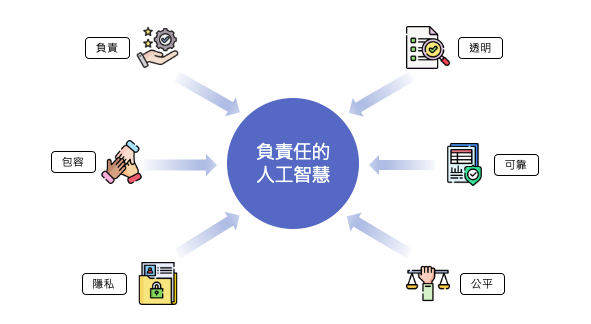

# [Day 29] XAI如何影響人類對技術的信任和接受程度？
在科技迅速進步的時代，人工智慧已經深深地融入了我們的生活，從`智慧製造`、`智慧醫療`、`智慧服務`到`智慧交通`，無所不在。然而這種深度的整合也伴隨著對於技術的信任和接受程度的關切。如今 XAI 已成為解決這些問題的關鍵，它不僅協助我們提高對技術的信任與對技術的接受程度。當一般大眾能夠理解 AI 如何達到特定的結果時，他們更有可能接受並使用這些技術。

- 透明：人工智慧系統應該易於理解。
- 可靠：人工智慧系統應確保運行可靠和安全。
- 公平：人工智慧系统應該公平對待所有人。
- 隱私：人工智慧系統應該保障並尊重隱私。
- 包容：人工智慧系統應確保每個人都能夠參與和受益。
- 負責：人工智慧系統應該建立監督標準。

一個負責任的人工智慧除了以上六項原則之外，另外 XAI 也引發了對 AI 倫理和道德的更多關注。想必這也是每個企業主和使用者所擔憂的議題，隨著對技術的信任增加，同時我們更關心 AI 的倫理道德和風險。

## AI的倫理道德
AI 的倫理道德一直是引起廣泛關注的議題，而機器學習作為 AI 的重要分支，其倫理問題更是引人深思。在今日的文章中，我們將深入探討機器學習中常見的道德問題，並借鏡一些真實例子來闡述這些議題的重要性。

#### [案例一] GPT偵測器具備語文上的偏見與歧視
在近期的一項研究中，使用這些生成式預訓練模型（GPT）偵測器來判斷英文文章是否來自 AI ，母語非英文的使用者在撰寫英文文章時，有超過一半的情況被誤認為是 AI 生成的文章。這引發了對 GPT 偵測器存在語文上的偏見和歧視的擔憂。在訓練 GPT 偵測器的過程中，研究人員使用了7款熱門的偵測器來檢查91篇源自中國論壇的托福寫作文章，以及88篇由美國8年級生所撰寫的英文作文。從實驗結果顯示，這些偵測器能較正確地分辨出由美國學生所撰寫的文章，但對於中國學生所撰寫的托福文章的識別率卻顯著下降，並誤判為是 AI 所生成的文章。

這一問題的根本在於訓練數據的不平衡和偏向性。當訓練數據不夠多樣化或存在偏向性時，模型就容易產生誤判和歧視性行為。因此為了建立更公正、無偏見的 AI 系統，需要謹慎挑選和處理訓練數據，並定期檢查和調整模型以減少偏見。這也反映了 AI 技術應該受到倫理和多元性的審視，以確保其應用不會對不同文化和語言的使用者產生不公平的影響。

- 相關報導：[非英語母語者寫的英文文章，有一半被GPT偵測器標記為AI生成](https://www.ithome.com.tw/news/157743?fbclid=IwAR1K6xShDCoDOIR-i_bzt3PrBvMQBdiC_O0hRnocJYA_oPqOTsWiH4x5aig)

#### [案例二] Google相簿出包誤將黑人標成大猩猩
在這個案例中，Google 相簿使用了機器學習技術來自動辨識照片中的物體和人物，但不幸的是，該系統在辨識中出現了一個重大錯誤。這個錯誤導致該系統將一位用戶以及他的黑人朋友的照片誤標為大猩猩，這引起了公眾的廣泛討論，並帶出了有關人工智慧的資訊倫理議題。

- 相關報導：[相片辨識出包誤將黑人標成大猩猩，Google火速道歉](https://www.ithome.com.tw/news/97131)

#### [案例三] 鐵面無私包青天？小心AI的內建歧視
近年來，美國法院廣泛使用名為「COMPAS」的 AI 系統，這是由商業公司開發的，用來協助法官評估被告的再犯風險，並作為判決的參考依據。然而許多[研究](https://www.propublica.org/article/machine-bias-risk-assessments-in-criminal-sentencing)已經明確指出，這套 AI 系統存在潛在的種族歧視問題，即有色人種更容易被預測為高再犯風險，這引發了廣泛的爭議和討論。

從案例二和案例三中我們可以看到，影像辨識技術在某些情況下存在未知的不確定性，並且容易受到種族歧視等問題的影響。這突顯了 AI 的一個關鍵限制：AI 缺乏真正的思考能力和判斷能力，而是依賴於訓練數據來做出決策。

- 相關報導：[AI 當法官，會是正義女神的化身嗎？](https://dq.yam.com/post/13034)

#### [案例四] AI攝影機誤把裁判的光頭當足球跟拍轉播
最後一個來點輕鬆的，在這個案例中，一家蘇格蘭足球俱樂部引入了一套AI攝影機系統，目的要自動追蹤足球比賽中球的蹤跡，以進行轉播。然而在比賽進行一段時間後，這套 AI 系統卻突然停止追蹤足球，而是將鏡頭對準了場邊的裁判光頭。這個事件凸顯出 AI 系統的不確定性和可信度問題。AI 攝影機系統的設計初衷是為了提供更好的比賽轉播體驗，但卻因為意外的失誤，導致了轉播的笑話。

這個案例強調了影像視覺可解釋性的重要性。如果 AI 攝影機系統能夠清晰地解釋其決策過程，或者提供有關為何選擇對準裁判光頭的合理解釋，可能有助於減輕事件的影響。

- 相關報導：[蘇格蘭AI攝影機誤把裁判的光頭當足球跟拍轉播](https://buzzorange.com/techorange/2020/11/02/ai-soccer-follow-bald-lineman/)
- 影像來源：[AI錯把光頭認足球](https://www.zhihu.com/zvideo/1306220010348875776)

## 建立對AI的信任
在建立對 AI 的信任方面，深度學習模型的可解釋性一直是一個關鍵的課題。深度學習模型的強大性能是不可否認的，但模型的高度抽象性也帶來了對其運作方式的不透明性。因此我們必須關注模型的解釋能力，以確保大眾能夠理解和信任模型的決策。

以金融業為例，我們可以看到深度學習模型在信用評分等領域的應用。在這樣的情境下，我們希望能夠回答一系列問題，以確保模型的信任度：

- 我們應該如何解釋模型中每個連接的權重，以理解它們在預測中的具體作用和含義？
- 哪些權重在最終預測中扮演了關鍵的角色，影響著最終結果？
- 權重的大小是否能提供有關輸入變數的相對重要性的訊息？

這些問題的答案對於金融機構以及任何其他使用 AI 的領域都非常重要。模型解釋性不僅有助於追蹤和理解模型的決策過程，還可以幫助檢測模型的偏見和錯誤。同時透明的模型解釋也可以提高使用者對AI系統的信任度，並推動更廣泛的技術應用。

例如一些金融機構如國泰金控已經開始使用 SHAP 演算法來解釋其 AI 模型的決策。他們還積極採用自建的公平性和反歧視模型驗證方法，以確保模型不會因種族、性別或其他因素而偏見。此外，他們引入了聯邦學習技術，以保護敏感數據並提高模型的安全性。同時，透過引入人類回饋，他們實踐了強化學習，不斷改進 AI 模型的性能，以符合 AI 治理原則的要求。

> 相關報導：[實踐AI治理原則國泰金控聚焦四大技術](https://www.ithome.com.tw/news/158850?fbclid=IwAR1uzScM5f_DQ9hobImf4Wxo-6p400LKNqHLv15s_U4DNAHTnuP91NrA1KQ)

## AI的信任和技術接受
XAI 對於提高人類對技術的信任和接受程度具有巨大的潛力。它為我們提供了一個機會，可以建立更加透明和可信賴的人機互動，並確保 AI 技術在未來的應用中取得成功。隨著 XAI 領域的不斷發展，我們可以期待看到更多創新和改進，這將進一步推動技術的進步和社會的發展。除了今天所提到的案例外，我們可以看到 XAI 是如何改變這些領域的技術接受程度和社會影響：

- 金融風險管理：如何利用可解釋的方法預測市場趨勢？
- 網路安全：如何利用可解釋性的方法檢測和防止攻擊？
- 社會公正：如何確保機器學習模型不歧視特定族群？
- 醫學診斷：用可解釋的方法解釋醫學圖像和診斷結果
- 生物醫學：從基因組學到蛋白質折疊的解釋性分析
- 法律：如何利用可解釋的方法幫助判決和解釋法律條文？
- 認知心理學：如何理解人類的決策和行為？
- 教育：如何利用可解釋的方法評估學生學習成效？

## Reference
- [Full Stack Deep Learning 2022: Lecture 9: Ethics](https://fullstackdeeplearning.com/course/2022/lecture-9-ethics/)

- [五張圖詳解企業如何建立可信任的AI](https://ek21.com/news/tech/191675/)
- [如何將DeepSHAP應用於神經網絡](https://kknews.cc/zh-tw/code/n9lyk23.html)
- [人工智慧也有歧視和偏見](https://zhuanlan.zhihu.com/p/68987264)
