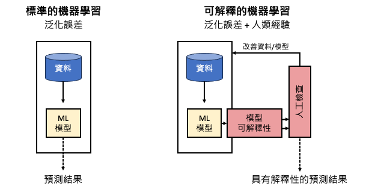

# [Day 5] 淺談XAI與傳統機器學習的區別
機器學習是一種透過對大量數據進行訓練和不斷優化演算法的方法，目的是提高預測準確性和決策可靠性。透過處理龐大的數據集，機器學習模型能夠自動學習並擬合出數據中的模式和關聯。儘管機器學習相關的套件和演算法不斷地突破，但在應用開發上仍面臨諸多有待克服的難題。我想這個問題也是你我的痛點，就是「AI 模型演算法驗證不易」成為發展瓶頸。由於我們無法逐一且明確列出模型背後的推論法則，所以只能將其視為一個龐大且複雜的數學模型。當我們使用傳統機器學習模型進行預測時（如：隨機森林、支持向量機...等），通常只會得到模型的預測結果，但是很難解釋為什麼模型會做出這樣的預測，這就是傳統機器學習模型的局限性。我們該如何說服客戶訓練的模型準確率很好，並且該如何證明它呢？這也就是我們現今所重視的 XAI（可解釋人工智慧）。

然而自2016年起國防高等研究計劃署（DARPA），也宣布將 XAI 列為接下來科技發展的重點。DARPA 是美國國防部所屬的研究機構，致力於推動科技創新和發展前沿技術，以增強美國國家安全和國防能力。透過 XAI，DARPA 希望能夠增加對 AI 系統的透明度，使其能夠更有效地與人類合作，提供可靠和解釋的結果，並降低對AI系統的依賴度。此外美國電氣和電子工程師協會（IEEE）也在2016、2017年先後發布[AI倫理設計準則](https://standards.ieee.org/news/ead_v2/)，從技術角度設立 AI 發展標準。

> 資料來源[DARPA's explainable AI (XAI) program: A retrospective](https://onlinelibrary.wiley.com/doi/full/10.1002/ail2.61)

> 延伸閱讀：[Making Things Explainable vs Explaining: Requirements and Challenges under the GDPR (arxiv)](https://arxiv.org/abs/2110.00758)

關於國際上的 AI 倫理準則，在法規方面，人工智慧的應用有必要明確定義其決策過程，以確保其可信度和透明度。歐盟在2018年修訂的「一般資料保護規範」（GDPR）中，提出了「要求解釋的權力」，旨在解決日益受到關注的演算法可能引發的問題。隔年歐盟議會更進一步的發佈「可信賴人工智慧倫理準則」確保人工智慧的發展和應用符合道德和倫理原則。

> 延伸閱讀：[歐盟議會發布《可信賴人工智慧倫理準則》](https://stli.iii.org.tw/article-detail.aspx?no=64&tp=1&d=8248)

## 為何需要解釋性？因為要改善模型
人工智慧在我們日常生活中的應用越來越普遍，以協助人類做出決策。這些決策可能涵蓋從生活方式的選擇到更複雜的決策，如設備故障預測、產品瑕疵檢測、商業決策、信貸批准和法庭判決等。許多機器學習演算法是黑盒子，缺乏透明度，這引起了人們對其可信度的擔憂。就如同下圖左邊的傳統標準化機器學習流程，透過大數據與泛化誤差概念去擬合一個模型。在機器學習中，泛化誤差（Generalization error）指的是模型在面對新的、未見過的資料時所產生的錯誤。換句話說，它是衡量模型在應用到新資料時的預測能力或泛化能力的一個指標。因此我們可以透過泛化誤差的大小來衡量模型在未曾見過的資料上的適應能力，這反映了模型從訓練資料中學習到的知識的有效性。如果泛化誤差過高，表示模型在新資料上的預測能力較差，可能存在過擬合或欠擬合的問題。所以降低泛化誤差是機器學習中的一個重要目標，可以透過調整模型結構、優化演算法、增加訓練資料等方式來實現。

> 在機器學習中，泛化誤差（Generalization error）指的是模型在面對新的、未見過的資料時所產生的錯誤。

而圖右是 XAI 搭配機器學習的概念，我們可以結合泛化誤差和人類經驗來進行機器學習建模。首先我們利用訓練資料來訓練模型並計算其泛化誤差，這可以告訴我們模型在未見過的數據上的適應能力。接著我們利用人類的經驗和領域知識來檢閱模型的決策過程和結果。這包括分析模型的特徵重要性、影響因素和預測結果的解釋，從中觀察模型是否有學到真實世界中的本質。這種結合能夠提高模型的預測能力和可解釋性，使我們更加信任和依賴於機器學習模型的結果。

為了對這些系統產生信任，人們希望能夠追究責任並獲得解釋。這需要能夠理解和解釋人工智慧系統背後的決策過程，以確保其可靠性和合理性。因此擺脫傳統的機器學習思維，透過 XAI，我們能夠了解解釋人工智慧模型背後的決策原理，確保決策的公正性和合理性，避免 AI 模型的不確定性造成無可挽回的失控。

## XAI的三個階段
我們可以將人工智慧的可解釋性分成三個階段：建模前、建模過程和模型上線。

- 建模前
  - 在建模前，我們著重於資料的解釋性，確保資料本身清晰且有意義。包括數據的標記、遺漏值的處理、特徵選擇和轉換等。
- 建模過程
  - 在建模階段，我們專注於開發可解釋的模型。包括選擇可解釋的機器學習算法，調整模型的超參數，以及使用解釋性技術（例如特徵重要性分析和決策規則提取）來解釋模型的預測能力。
- 模型上線
  - 確定最終的模型後即可部署模型並於實際場域中運行。此階段著重於解釋決策和傳遞模型的預測結果。

## 各行各業都需要具備可解釋性的AI
大部分機器學習系統主要集中在像是 Google 和 Meta 這類型的科技公司，這些系統的錯誤預測可能會導致對用戶的錯誤訊息。然而近年來 AI 有跨足不同領域的趨勢，當這些系統應用於其他行業，如醫療、軍事和金融...等。錯誤的預測就可能產生負面後果，甚至影響到許多人的生活。因此我們需要建立能夠解釋其決策過程的人工智慧系統。這樣的系統可以提供透明的決策解釋，使我們能夠理解它們的決策基礎，確保其合理性並減少潛在的風險。透過這樣的解釋性人工智慧系統，我們可以更好地應對機器學習在各個領域中可能帶來的挑戰，確保其應用的安全性和可靠性。

## Reference
- [DARPA Explainable Artificial Intelligence by David Gunning](https://sites.cc.gatech.edu/~alanwags/DLAI2016/(Gunning)%20IJCAI-16%20DLAI%20WS.pdf)
- [DARPA XAIforNASA by David Gunning](https://asd.gsfc.nasa.gov/conferences/ai/program/003-XAIforNASA.pdf)
- [Explainable AI by Mitosis Business Enablers](https://www.slideshare.net/dineshv62/explainable-ai-238430774)
- [wikipedia 可解釋人工智慧](https://zh.wikipedia.org/zh-tw/%E5%8F%AF%E8%A7%A3%E9%87%8B%E4%BA%BA%E5%B7%A5%E6%99%BA%E6%85%A7)