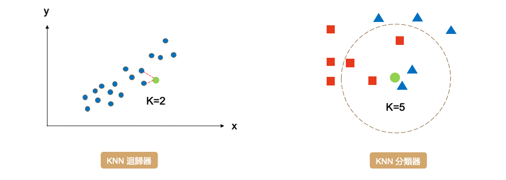

# [Day 7] KNN與XAI：從鄰居中找出模型的決策邏輯

範例程式：[](https://colab.research.google.com/github/andy6804tw/2023-15th-ironman/blob/main/code/07.KNN與XAI：從鄰居中找出模型的決策邏輯.ipynb)

KNN 是一種監督式學習算法，它可以用於分類和迴歸問題。在分類問題中，KNN 透過找到最近的 k 個鄰居取多數決來預測一個新樣本的類別。在迴歸問題中，KNN 則透過找到最近的 k 個鄰居的平均來預測一個新樣本的數值。



> 理論知識可以參考全民瘋AI系列2.0[近朱者赤，近墨者黑 - KNN](https://ithelp.ithome.com.tw/articles/10269826)

KNN 與其他監督式機器學習演算法的不同之處在於，它是屬於一種 instance-based 演算法。簡單來說 KNN 模型沒有要學習的參數，它只是將所有的訓練資料儲存起來，當遇到新的資料時，就比對新資料和舊資料的相似程度(距離)，來決定新資料的預測。另外 KNN 缺少全局模型可解釋性，因為該模型本質上是局部的，並且沒有明確學習全局權重或結構。

## [實作] KNN 的局部解釋性
KNN 方法的可解釋性在局部解釋方面相對較好。因為對於每個單獨的預測結果，我們可以解釋為什麼這些鄰居被選中了，以及這些鄰居中的樣本如何影響預測結果。這種方法在局部解釋方面是相對較好的，因為我們可以查看單個預測的過程和選擇的鄰居，並評估它們對預測的貢獻。其最簡單的方式就是將特徵透過降維方式映射到三維空間內，並透過視覺化的方式觀察 K 個鄰近的點在哪裡。詳細教學可以參考[非監督式學習-降維](https://ithelp.ithome.com.tw/articles/10267685)。

以下是使用 KNN 分類鳶尾花朵的範例程式，同時展示了如何使用 kneighbors 方法來解釋模型，查看每個樣本的最近鄰居。

```py
from sklearn.datasets import load_iris
from sklearn.neighbors import KNeighborsClassifier
from sklearn.model_selection import train_test_split
import numpy as np

# 載入鳶尾花朵資料集
iris = load_iris()
X = iris.data
y = iris.target

# 切分訓練集與測試集
X_train, X_test, y_train, y_test = train_test_split(X, y, test_size=0.3, random_state=42, stratify=y)

# 訓練 KNN 分類器
knnModel = KNeighborsClassifier(n_neighbors=3)
knnModel.fit(X_train, y_train)

# 評估模型的準確率
print('訓練集: ',knnModel.score(X_train,y_train))
print('測試集: ',knnModel.score(X_test,y_test))

# 取得第一個測試樣本的最近的鄰居
distances, indices = knnModel.kneighbors(X_test[[0]])

# 局部解釋：顯示最近鄰居的類別和對應的特徵值
print('Sample belongs to class:', y_test[0])
print('Neighbors belong to classes:', y_train[indices[0]])
print('Nearest neighbors:', X_train[indices[0]])
```

執行結果：
```
訓練集:  0.9619047619047619
測試集:  0.9555555555555556
Sample belongs to class: 2
Neighbors belong to classes: [2 2 2]
Nearest neighbors: [[7.4 2.8 6.1 1.9]
 [7.2 3.2 6.  1.8]
 [7.6 3.  6.6 2.1]]
```

可以看到，測試集的第一個樣本屬於類別 2，其最近的 3 個鄰居也都屬於類別 2。透過 kneighbors 方法，我們可以對模型做局部解釋，解釋每個樣本的預測是基於哪些最近鄰居進行的。

另外 kneighbors 回傳的資訊包括:

- distances: 返回一個維度 (n_samples, n_neighbors) 的陣列，表示每個樣本和它的最近鄰居之間的距離。
- indices: 返回一個維度 (n_samples, n_neighbors) 的陣列，表示每個樣本的最近鄰居的索引。這些索引可以用來檢索訓練資料中對應的最近鄰居。

其中 n_samples 是樣本數量，n_neighbors 是鄰居數量。在這裡，每個樣本的最近鄰居數量都是事先指定的。這個方法回傳的資訊可以用來獲取最近鄰居的特徵和目標值，從而進行模型解釋和分析。

當然我們也可以透過其他方法以全局的觀點解釋 KNN 模型，像是 Permutation Importance 可以資料擾動方式找到重要特徵。關於這部分內容，之後會專門寫一篇文為大家講解！