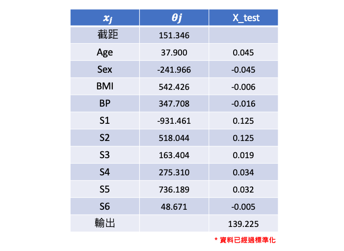
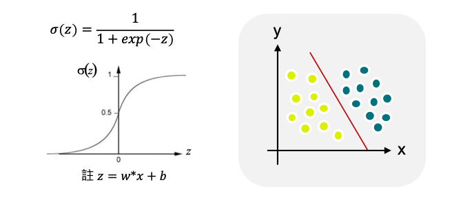

# [Day 8] 解釋線性模型：探索線性迴歸和邏輯迴歸的可解釋性
## 線性迴歸模型
線性迴歸是一種統計學方法，用於建立自變數(x)和應變數(y)之間的線性關係模型。線性迴歸假設應變數是由一個或多個自變數線性組合而成的，且自變數之間不存在多重共線性，誤差項是獨立同分佈的，且呈現常態分佈。


> 圖片來源：[reliawiki](http://reliawiki.org/index.php/Simple_Linear_Regression_Analysis)

在線性迴歸中，我們假設應變數和自變數之間存在一種線性關係，並使用最小平方法或梯度下降法來找到最佳擬合直線。整個線性迴歸的目標就是最小化我們的損失函數，因此最後可以用這條直線預測新數據點的值。


> 理論知識可以參考全民瘋AI系列2.0[線性迴歸 (Linear Regression)](https://ithelp.ithome.com.tw/articles/10268453)

## 解釋線性迴歸模型的方法（係數解釋、截距解釋）
接著我們來探討解釋線性迴歸模型的方法，一種常見的解釋線性迴歸模型的方法是係數解釋。這種方法通過分析迴歸模型的係數，來解釋自變數對應變數的影響。在簡單線性迴歸模型中，自變數的係數可以直接解釋為自變數對應變數的影響程度，例如當自變數增加1個單位時，應變數會增加多少個單位。在多元線性迴歸模型中，則需要考慮多個自變數的影響，通常可以通過控制其他變數的影響，來分析某一個自變數對應變數的影響。

另一種解釋線性迴歸模型的方法是截距解釋。截距在線性迴歸模型中表示當所有自變數均為0時，應變數的期望值，通常被稱為模型的基準值。截距的解釋可以幫助我們理解當自變數均為0時，應變數的期望值是多少。例如，在一個簡單線性迴歸模型中，截距可以解釋為當自變數等於0時，應變數的期望值是多少。在多元線性迴歸模型中，截距的解釋可以幫助我們理解當所有自變數均為0時，應變數的期望值是多少，這對於理解模型的基準值和比較不同模型的表現非常重要。


## [實作] 線性迴歸：糖尿病預測
diabetes 資料集是由美國糖尿病資料集中選取的442名病患的生物醫學數據集合。這些數據由10個生理特徵和1個預測目標（糖尿病患者在一年後的疾病進展情況）組成。每個特徵的意義如下：

- Age：年齡
- Sex：性別（1表示男性，0表示女性）
- Body mass index (BMI)：身體質量指數
- Average blood pressure (BP)：平均血壓
- S1：總膽固醇
- S2：低密度脂蛋白
- S3：高密度脂蛋白
- S4：總膽固醇/高密度脂蛋白
- S5：血清甘油三酯水平的對數
- S6：血糖水平

```py
from sklearn.datasets import load_diabetes
from sklearn.model_selection import train_test_split

# 載入Sklearn糖尿病預測資料集10個輸入特徵1個輸出
diabetes = load_diabetes()
X = diabetes.data # 輸入特徵
y = diabetes.target # 輸出
# 切分訓練集測試集
X_train, X_test, y_train, y_test = train_test_split(X, y, test_size=0.2, random_state=42)
```

使用 Sklearn 建立線性迴歸模型。
```py
from sklearn.linear_model import LinearRegression
# 訓練模型
linearModel = LinearRegression()
linearModel.fit(X_train, y_train)
```

模型訓練好以後，就可以觀察線性模型的特徵係數以及截距。
```py
# 取得10個特徵係數
print(linearModel.coef_)
# 取得截距
print(linearModel.intercept_)
```

在本例子中輸入有十個特徵，因此線性迴歸式中每個特徵項都會對應一個係數。假設我們從測試集中提取一筆資料預測。由於輸入特徵已經過標準化，因此我們可以很快地觀察各項係數的大小來辦定特徵重要程度。可以發現在什麼都不輸入時會有個基底值(截距)151.346。



## 邏輯迴歸模型
線性迴歸和邏輯迴歸差別在於線性迴歸的目標是預測連續數值型的因變量。它基於線性關係建立模型，並且假設因變量和自變量之間存在線性關係。而邏輯迴歸也建立在一個線性模型的基礎上，但是它將線性模型的輸出通過一個稱為 S 形曲線（sigmoid 函數）的轉換，將線性模型的輸出映射到0和1之間，這樣預測結果就變成了二元類別。



因此我們可以理解這個邏輯迴歸的輸出就相當於，模型根據輸入的特徵判斷結果是1的機率有多高。


> 理論知識可以參考全民瘋AI系列2.0[邏輯迴歸 (Logistic Regression)](https://ithelp.ithome.com.tw/articles/10269006)

## 解釋邏輯迴歸模型的方法 (odds ratio)
那麼邏輯迴歸該如何解釋呢？首先我們可以說預測出來的 ŷ 相當於是 y(i) 等於1的機率有多高(依據上面的公式)。另外還可以發現一件事情就是我們如果吧 `P(y(i)=1)` 除以 `P(y(i)=0)` 再取 log 之後其實是一個線性的關係。


`P(y(i)=1)` 除以 `P(y(i)=0)` 在統計上有個名詞稱之為勝算（odds），也就是「Y=1的機率」與「Y=0的機率」的比率。如果事件發生的機率是 p，那麼其不發生的機率就是 1-p，那麼此事件的勝算比就是 p/(1-p)。


以銅板的例子來說，假設我們想要預測一個公平的銅板翻轉出現正面的機率，由於正反面出現的機率相等，因此 p=1/2。根據上述公式，其勝算比就是 p/(1-p) = (1/2) / (1/2) = 1，也就是說翻轉公平銅板出現正面的勝算比是1。

接著再以一個不公平的銅板為例，假設這個銅板正面朝上的機率是3/5，因此 p=3/5。根據上述公式，其勝算比就是 p/(1-p) = (3/5) / (2/5) = 3/2，也就是說翻轉這個不公平的銅板出現正面的勝算比是 3/2。

基於上述例子我們可以得出以下結論：
- 當 odds 大於1時，表示事件的發生機率較高，此時因變數 y 為1的機率較大。
- 當 odds 介於0和1之間時，表示事件的發生機率較低，此時因變數 y 為0的機率較大。

假設對數勝算（log odds）是一個線性函數，我們把 log 搬移到右邊變成取 exp 變成以下式子：


所以我們可以在邏輯迴歸模型中，利用 odds ratio（勝算比）來解釋變數對於反應變數的影響。odds ratio 是指當一個自變數 X 的值增加 1 單位時，對應的勝算會乘上一個倍數，這個倍數即為 odds ratio。

具體來說，如果一個變數 X 的 odds ratio 為 2，表示當 X 增加 1 單位時，Y=1 的機率相對於 Y=0 的機率將會增加 2 倍。而如果 odds ratio 為 0.5，則表示當 X 增加 1 單位時，Y=1 的機率相對於 Y=0 的機率將會減少一半。

- 如果 odds ratio 越大，表示該自變數對於反應變數的影響越大
- 如果 odds ratio 為 1，表示該自變數對於反應變數沒有影響
- 如果 odds ratio 小於 1，表示該自變數與反應變數呈現反向關係。

然而在邏輯迴歸模型中，每個自變量都會有一個 odds ratio 值，可以通過比較 odds ratio 值的大小來判斷哪些自變量對事件發生的機率有較大的影響。在 sklearn 中，可以使用 LogisticRegression 模型的 coef_ 屬性獲取特徵的係數，並將其指數化以得到 odds ratio。以下是一個簡單的範例 code：

```py
from sklearn.linear_model import LogisticRegression
import numpy as np

# 載入自己的資料集
X = ...略
y = ...略

# 建立 Logistic Regression 模型並訓練
model = LogisticRegression()
model.fit(X, y)

# 獲取係數
coef = model.coef_

# 將係數指數化得到 odds ratio
odds_ratio = np.exp(coef)
```

在這個範例中，X 是訓練資料，y 是每筆資料對應的標籤。獲取 coef_ 屬性之後，可以使用 np.exp() 函數將係數指數化。這樣可以得到所有特徵的 odds ratio 值，近一步的分析當 X 的值增加 1 單位時，所對應的勝算來觀察特徵重要性。

## 小結
線性迴歸用於預測一個連續的數值，例如預測股票的價格或房屋的價格等。它假設自變數和因變數之間有線性關係，也就是說，當自變數的值增加一個單位時，因變數的值也會按比例增加或減少。

邏輯迴歸用於預測二元變數，例如預測某人是否患有某種疾病、電子郵件是否為垃圾郵件等。邏輯迴歸使用 sigmoid 函數將輸出限制在0到1之間，表示因變數屬於某個類別的機率。如果機率大於0.5，那麼我們就預測為1，否則預測為0。


線性迴歸的基本概念和假設是建立在數學統計學理論上，理解和掌握這些概念和假設可以幫助我們更好地應用線性迴歸模型進行實際問題的解決。綜上所述，線性迴歸模型的係數和截距是解釋自變數對應變數的影響和模型基準值的重要因素，透過對這些因素的分析，可以幫助我們更好地理解線性迴歸模型的行為。
