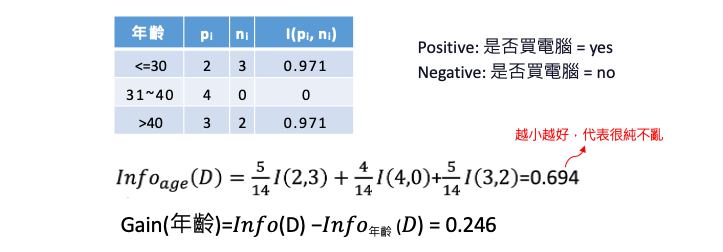
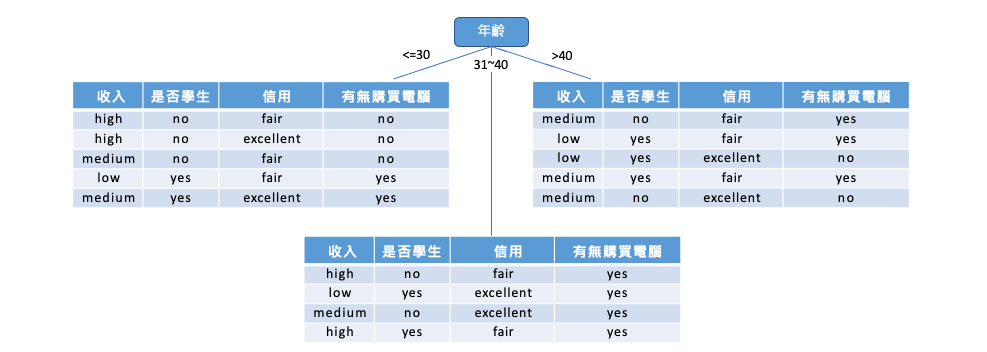
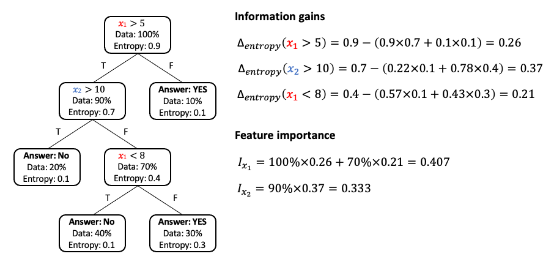
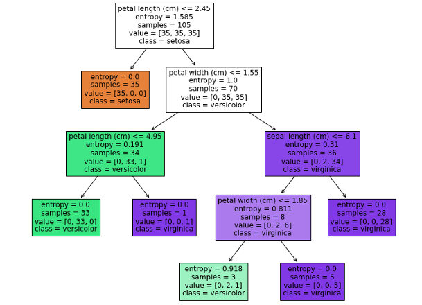

# [Day 9] 基於樹狀結構的XAI方法：決策樹的可解釋性
範例程式：[](https://colab.research.google.com/github/andy6804tw/crazyai-xai/blob/main/code/09.基於樹狀結構的XAI方法：決策樹的可解釋性.ipynb)


- 透過特徵重要性了解機器學習模型的決策過程

## 決策樹
決策樹是一種監督式學習演算法，用於解決分類或迴歸問題。該方法透過對訓練集資料的分析來建構一棵樹狀結構的模型，其中每個內部節點都代表一個特徵，每個葉子節點代表一個分類或迴歸結果。對於新的數據樣本，它可以通過從根節點開始遍歷樹狀模型，並將其歸類到相應的葉子節點中。


> Image source: [freepik.com](https://www.freepik.com/)

決策樹的概念是給定一組訓練資料，透過所有的特徵試法找到合適的特徵分成幾組後純度的分數要越小越好。衡量純度(亂度)的指標大致分為 Entropy 與 Gini index 兩種。

- Entropy：熵是一種衡量系統不穩定程度的指標，熵越高表示系統越不穩定。
- Gini index：吉尼係數是另一種用於計算亂度的指標，也可以用於判斷數據集的純度。數值越小表示數據集越純。

> 理論知識可以參考全民瘋AI系列2.0[決策樹 (Decision tree)](https://ithelp.ithome.com.tw/articles/10271143)

## 決策樹如何解釋？
以下舉例說明如何透過年齡、收入、是否為學生以及信用評等特徵，來預測一個人是否會購買電腦。我們的目標是利用下面這張表格建立一棵決策樹，以便未來預測時能夠依據此樹進行判斷。問題在於，我們該如何利用這張表格來建立決策樹呢？


在建出這棵樹之前我們要先算在做任何事之前這個資料到底有多亂？如果用 Entropy 來算這十四人當中有九位會買電腦，另外五位不會買電腦。我們可以表示成 Info(9, 5) 算出來的亂度是 0.94。也就代表在我不做任何事情之前這十四位總共有 0.94 這麼亂。


接下來要做的是使用第一個年齡特徵把這十四位分成三組，並算算看分完結果有多亂。計算完後同時也算看看收入、是否學生、信用評等這幾個特徵分完後計算這個 Entropy 是最純的。如果我們用年齡把人分成三組，整體的亂度是 0.694(越小越好)。因此我們可以求得使用年齡這個特徵得到的純度進步了 0.246。



同理我們可以計算及他的特徵所帶來的純度，可以發現這四個特徵第一個步驟用年齡來分會讓結果是最純的。

- Gain(年齡) = 0.246
- Gain(收入) = 0.029
- Gain(是否學生) = 0.151
- Gain(信用) = 0.048

因此第一步會將年紀分為三組，接著在年輕這個節點我們可以很清楚地看出使用是否學生這個特徵可以很完美的將這五人分開。



因此我們可以透過剛剛的方法依序計算，選擇最適合的特徵進行最佳分類。最後建立出這棵樹，進而能夠提供很好的解釋性。


## 決策樹的特徵重要性
決策樹也可以透過特徵重要性計算哪些特徵是重要的。想想看如果你建出一棵樹，什麼叫做一個特徵很重要？首先是如果這個特徵影響很多樣本的決策，再者該特徵透過亂度計算可以讓結果很純的話該特徵扮演重要角色。因此我們會希望能夠透過以上兩點綜合考量，合理的判斷哪個特徵重要。


假設有兩個特徵 X1 和 X2，其原始資料亂度為 0.9 經過 x1 特徵下去切割後得到的純度進步了 0.26。接下來一樣計算左邊分枝透過 x2 特徵切割後純度進步了 0.37。經過以上反覆計算我們可以得知每個節點透過某特徵切割後純度會進步多少？下一步就是計算每個節點有多少的資料比例會經過，之後就可以計算 x1 跟 x2 有多重要了。以 x1 來說第一個節點所有樣本都會被拿來評估因此 100%×0.26，接著在另個節點 x1 有百分之七十的樣本會被拿來評估，且評估完後純度平均會進步 0.21 因此 70%×0.21。綜合加起來 x1 的重要程度有 0.407。



## [實作] 決策樹分類器解釋
以下範例使用鳶尾花朵資料集。程式碼中使用了 load_iris() 函式將鳶尾花朵資料集載入，將資料存放在 X 與 y 兩個變數中，分別代表資料集中的特徵值與目標變數。最後使用 train_test_split() 函式將資料集切分成訓練集與測試集。

```py
from sklearn.datasets import load_iris
from sklearn.neighbors import KNeighborsClassifier
from sklearn.model_selection import train_test_split
import numpy as np

# 載入鳶尾花朵資料集
iris = load_iris()
X = iris.data
y = iris.target

# 切分訓練集與測試集
X_train, X_test, y_train, y_test = train_test_split(X, y, test_size=0.3, random_state=42, stratify=y)
```

接著使用 sklearn 中的 [DecisionTreeClassifier](https://scikit-learn.org/stable/modules/generated/sklearn.tree.DecisionTreeClassifier.html#sklearn.tree.DecisionTreeClassifier) 建立了一個決策樹模型。首先，使用 criterion = 'entropy' 指定模型使用資訊熵作為分裂標準，這表示決策樹會優先選擇分裂後的子集更加純粹（即更少的混亂）的特徵。此外我們可以對模型進行一些客製化的設定，max_depth=4 是指定決策樹的最大深度為 4 層，這表示決策樹最多可以分裂出 4 層子樹。各位可以試著觀察隨著樹深度越大是否能夠讓模型變得更準確。

```py
from sklearn.tree import DecisionTreeClassifier

# 建立 DecisionTreeClassifier 模型
decisionTreeModel = DecisionTreeClassifier(criterion = 'entropy', max_depth=4, random_state=42)
# 使用訓練資料訓練模型
decisionTreeModel.fit(X_train, y_train)
```

訓練結束後可以透過 `get_depth()` 方法查看決策樹模型的深度。若在建立模型時為給定 `max_depth` 數值，則模型在訓練期間樹會不斷擴展，直到所有的葉子節點都是純的（即樣本屬於同一個類別），或者葉子節點包含的樣本數小於 min_samples_split 所設定的值。

> max_depth參數的設定會影響決策樹的複雜度和過擬合問題，通常需要通過交叉驗證等方式進行調參。

```py
print('決策樹最大深度: ',decisionTreeModel.get_depth())
```

執行結果：
```
決策樹最大深度:  4
```

[plot_tree](https://scikit-learn.org/stable/modules/generated/sklearn.tree.plot_tree.html) 是 sklearn 中用於繪製決策樹模型的方法。該方法可以繪製出已擬合決策樹模型的樹形結構，以便進行模型的解釋和視覺化。
```py
from sklearn.tree import plot_tree
import matplotlib.pyplot as plt

plt.figure(figsize=(12, 10))
plot_tree(decisionTreeModel, feature_names=iris.feature_names, class_names=iris.target_names, filled=True)
plt.show()
```




我們也可以透過 `feature_importances_` 來取得決策樹模型中各個特徵的重要性值。重要性值越高的特徵，表示在決策樹中其影響力越大，能夠對預測結果產生較大的影響。
```py
importances = decisionTreeModel.feature_importances_
indices = np.argsort(importances)[::-1]
for f in range(X_train.shape[1]):
    print(f'{feature_names[indices[f]]}: {importances[indices[f]]}')
```

執行結果：
```
petal length (cm): 0.6289008293445076
petal width (cm): 0.34266728207712693
sepal length (cm): 0.028431888578365407
sepal width (cm): 0.0
```

從結果可以看出，花瓣的長度（petal length）是影響鳶尾花分類的最重要特徵，其重要性得分為 0.6289，其次是花瓣的寬度（petal width），其得分為 0.3427。而花萼長度（sepal length）對分類影響相對較小，得分僅為 0.0284。另一方面，花萼寬度（sepal width）的得分為 0，表示在這個模型中，花萼寬度對於鳶尾花的分類貢獻非常小或者可以忽略不計。我們也可從視覺化的圖中發現確實花萼寬度沒有在任一節點中出現。

## Reference
- [cse352 DECISION TREE CLASSIFICATION](https://www3.cs.stonybrook.edu/~cse352/L8DTIntro.pdf)